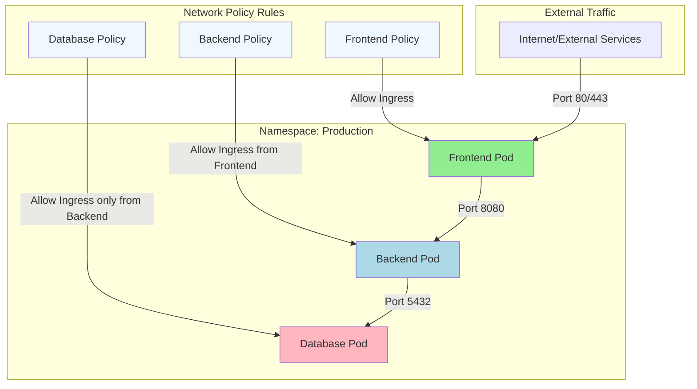

# Kubernetes Network Policy Explanation

## Basic Concepts

1. **Default Behavior**
   - Without Network Policies: All pods can communicate with each other
   - With Network Policies: Only explicitly allowed traffic is permitted

2. **Policy Types**
   - Ingress: Controls incoming traffic
   - Egress: Controls outgoing traffic

## Example Scenarios (as shown in diagram)

### Frontend Pod
- Accepts traffic from internet on ports 80/443
- Can send traffic to Backend Pod

### Backend Pod
- Only accepts traffic from Frontend Pod on port 8080
- Can send traffic to Database Pod

### Database Pod
- Only accepts traffic from Backend Pod on port 5432
- Highly restricted for security

## Sample Network Policy YAML

```yaml
apiVersion: networking.k8s.io/v1
kind: NetworkPolicy
metadata:
  name: backend-policy
  namespace: production
spec:
  podSelector:
    matchLabels:
      app: backend
  policyTypes:
  - Ingress
  ingress:
  - from:
    - podSelector:
        matchLabels:
          app: frontend
    ports:
    - protocol: TCP
      port: 8080
```

## Best Practices

1. **Start Restrictive**
   - Begin with denying all traffic
   - Gradually add necessary permissions

2. **Use Labels Effectively**
   - Label pods properly for easy policy targeting
   - Use namespace labels for cross-namespace policies

3. **Regular Review**
   - Audit network policies regularly
   - Remove unnecessary permissions

4. **Testing**
   - Test policies in development first
   - Use network policy testing tools

## Common Use Cases

1. **Isolation Levels**
   - Environment isolation (dev/staging/prod)
   - Service isolation within namespace
   - Database protection

2. **Security Compliance**
   - PCI-DSS requirements
   - Zero-trust security model
   - Audit logging requirements
