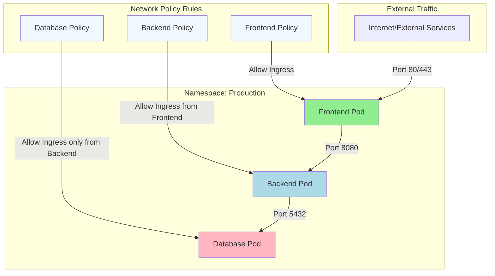
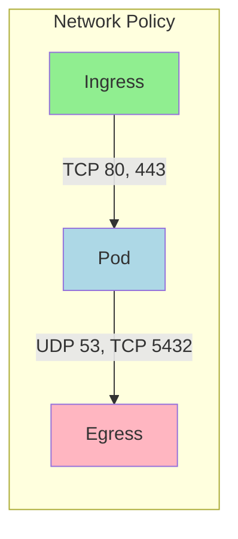
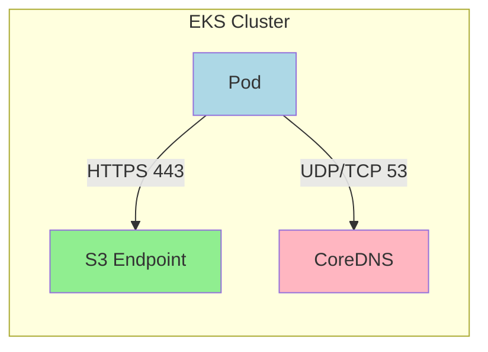
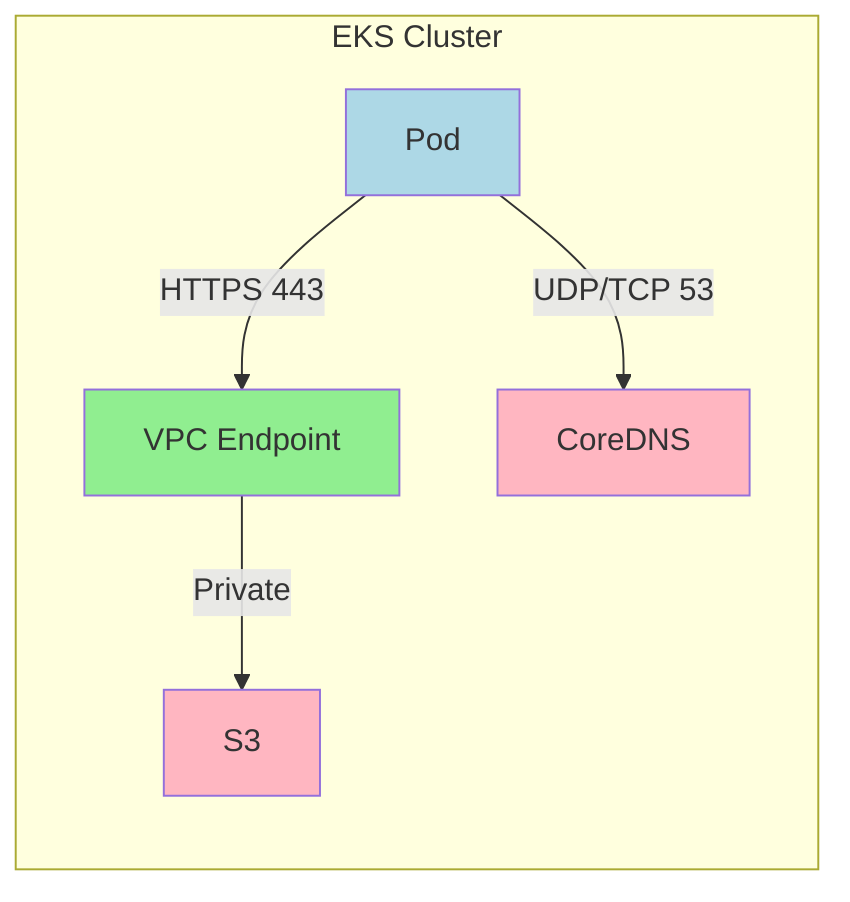

# Kubernetes Network Policy Explanation

## Basic Concepts

1. **Default Behavior**
   - Without Network Policies: All pods can communicate with each other
   - With Network Policies: Only explicitly allowed traffic is permitted

2. **Policy Types**
   - Ingress: Controls incoming traffic
   - Egress: Controls outgoing traffic

## Example Scenarios (as shown in diagram)

### Frontend Pod
- Accepts traffic from internet on ports 80/443
- Can send traffic to Backend Pod

### Backend Pod
- Only accepts traffic from Frontend Pod on port 8080
- Can send traffic to Database Pod

### Database Pod
- Only accepts traffic from Backend Pod on port 5432
- Highly restricted for security

## Sample Network Policy YAML

```yaml
apiVersion: networking.k8s.io/v1
kind: NetworkPolicy
metadata:
  name: backend-policy
  namespace: production
spec:
  podSelector:
    matchLabels:
      app: backend
  policyTypes:
  - Ingress
  ingress:
  - from:
    - podSelector:
        matchLabels:
          app: frontend
    ports:
    - protocol: TCP
      port: 8080
```

## Protocol and Port Configuration

Network Policies allow you to specify protocols and ports in both ingress and egress rules. Here's a detailed explanation:

### Supported Protocols

1. **TCP (Default)**
   ```yaml
   ports:
   - protocol: TCP
     port: 80
   ```

2. **UDP**
   ```yaml
   ports:
   - protocol: UDP
     port: 53
   ```

3. **SCTP**
   ```yaml
   ports:
   - protocol: SCTP
     port: 28
   ```

### Port Specifications

1. **Single Port**
   ```yaml
   ports:
   - protocol: TCP
     port: 80
   ```

2. **Port Range**
   ```yaml
   ports:
   - protocol: TCP
     port: 32000
     endPort: 32768
   ```

3. **Named Ports**
   ```yaml
   ports:
   - protocol: TCP
     port: http  # matches containerPort name
   ```

### Common Protocol-Port Combinations

1. **Web Traffic**
   ```yaml
   ports:
   - protocol: TCP
     port: 80    # HTTP
   - protocol: TCP
     port: 443   # HTTPS
   ```

2. **Database Traffic**
   ```yaml
   ports:
   - protocol: TCP
     port: 3306  # MySQL
   - protocol: TCP
     port: 5432  # PostgreSQL
   - protocol: TCP
     port: 27017 # MongoDB
   ```

3. **DNS Traffic**
   ```yaml
   ports:
   - protocol: UDP
     port: 53    # DNS queries
   - protocol: TCP
     port: 53    # DNS zone transfers
   ```

### Best Practices

1. **Default Protocol**
   - If protocol is not specified, TCP is assumed
   - Always explicitly specify protocol for clarity

2. **Port Ranges**
   - Use port ranges sparingly
   - Document why port ranges are needed
   - Consider security implications

3. **Named Ports**
   - Ensure container port names match policy
   - Use consistent naming across deployments
   - Document port name conventions

### Example with Multiple Protocols

```yaml
apiVersion: networking.k8s.io/v1
kind: NetworkPolicy
metadata:
  name: multi-protocol-policy
spec:
  podSelector:
    matchLabels:
      app: web
  policyTypes:
  - Ingress
  - Egress
  ingress:
  - ports:
    - protocol: TCP
      port: 80
    - protocol: TCP
      port: 443
  egress:
  - ports:
    - protocol: UDP
      port: 53    # DNS
    - protocol: TCP
      port: 5432  # PostgreSQL
```

### Visualization Example



### Important Notes

1. **Protocol Enforcement**
   - Network policies are enforced at Layer 3/4
   - Application layer protocols not directly filtered
   - Use service mesh for L7 traffic control

2. **Port Validation**
   - Invalid port numbers will be rejected
   - Valid port range: 1-65535
   - Named ports must exist in pod spec

3. **Performance Considerations**
   - Each port rule adds processing overhead
   - Group related ports when possible
   - Consider impact on large clusters

## Best Practices

1. **Start Restrictive**
   - Begin with denying all traffic
   - Gradually add necessary permissions

2. **Use Labels Effectively**
   - Label pods properly for easy policy targeting
   - Use namespace labels for cross-namespace policies

3. **Regular Review**
   - Audit network policies regularly
   - Remove unnecessary permissions

4. **Testing**
   - Test policies in development first
   - Use network policy testing tools

## Common Use Cases

1. **Isolation Levels**
   - Environment isolation (dev/staging/prod)
   - Service isolation within namespace
   - Database protection

2. **Security Compliance**
   - PCI-DSS requirements
   - Zero-trust security model
   - Audit logging requirements

## AWS S3 Access Configuration

When configuring network policies for pods accessing AWS S3, you have two main approaches:

### 1. Direct S3 Access



Requirements:
- Allow egress to S3 CIDR ranges (port 443)
- Allow DNS resolution (port 53 TCP/UDP)
- Ensure proper IAM roles/permissions

### 2. VPC Endpoint Access (Recommended)



Benefits of VPC Endpoints:
- Traffic stays within VPC
- Better security
- Lower latency
- No NAT gateway costs

### Implementation Steps

1. **Create VPC Endpoint**:
   ```bash
   aws ec2 create-vpc-endpoint \
     --vpc-id <your-vpc-id> \
     --service-name com.amazonaws.<region>.s3 \
     --route-table-ids <route-table-id>
   ```

2. **Apply Network Policy**:
   - Allow HTTPS (443) to VPC CIDR
   - Allow DNS resolution
   - No public internet access needed

3. **Configure IAM**:
   - Use IRSA (IAM Roles for Service Accounts)
   - Limit S3 bucket access

### Best Practices

1. **Security**:
   - Use VPC endpoints when possible
   - Restrict to specific S3 buckets
   - Enable VPC endpoint policies

2. **Performance**:
   - Consider regional S3 buckets
   - Monitor endpoint capacity
   - Use appropriate instance types

3. **Monitoring**:
   - Enable VPC Flow Logs
   - Monitor S3 access patterns
   - Set up alerts for failures

### Common Issues

1. **DNS Resolution**:
   - Ensure CoreDNS access
   - Check DNS configuration
   - Verify endpoint DNS names

2. **IAM Permissions**:
   - IRSA configuration
   - Role trust relationships
   - Bucket policies

3. **Network Connectivity**:
   - VPC endpoint status
   - Security group rules
   - Network policy conflicts
