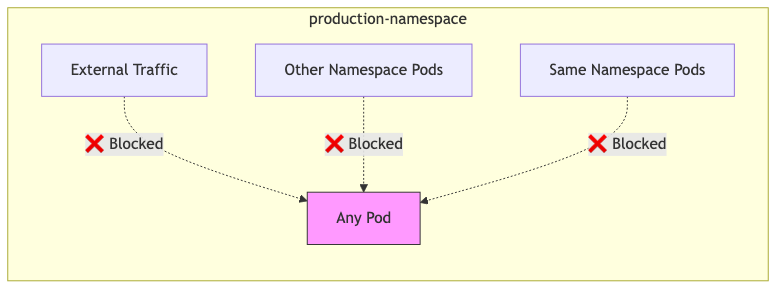
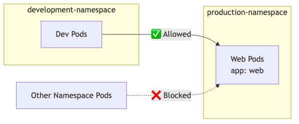
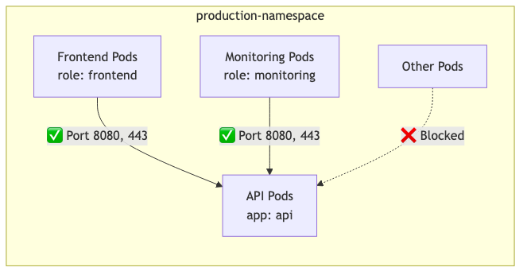
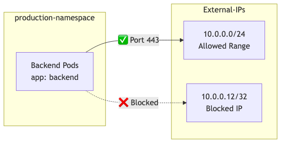
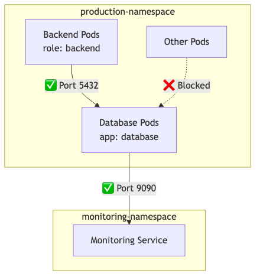
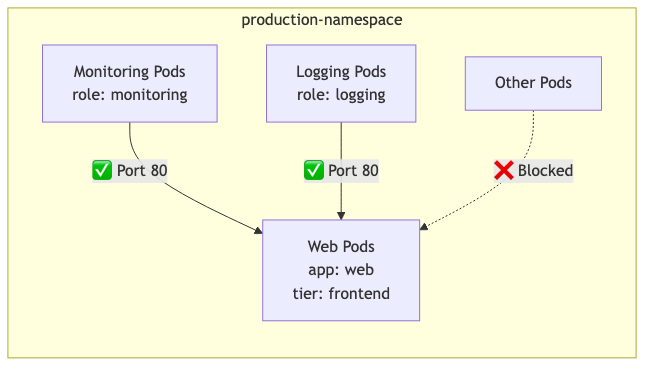
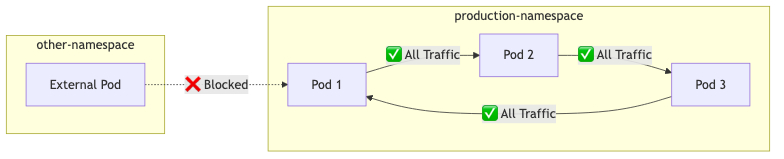
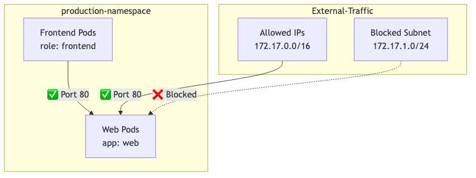
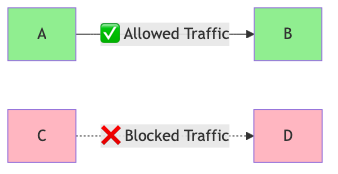

# Network Policy Flow Diagrams

## Example 1: Deny All Ingress Traffic
### Flow Diagram


### Purpose
- Creates a default deny rule for all incoming traffic
- Starting point for zero-trust security model
- Blocks ALL incoming traffic unless explicitly allowed by other policies

### Policy Code
```yaml
apiVersion: networking.k8s.io/v1
kind: NetworkPolicy
metadata:
  name: default-deny-ingress
  namespace: production
spec:
  podSelector: {}  # Empty selector means select all pods
  policyTypes:
  - Ingress      # Only applying to incoming traffic
```

## Example 2: Allow Traffic from Specific Namespace
### Flow Diagram


### Purpose
- Enable cross-namespace communication with specific restrictions
- Allow traffic only from development namespace to specific pods
- Requires the source namespace to have the label environment: development

### Policy Code
```yaml
apiVersion: networking.k8s.io/v1
kind: NetworkPolicy
metadata:
  name: allow-from-dev-namespace
  namespace: production
spec:
  podSelector:           # This policy applies to pods with label app: web
    matchLabels:
      app: web
  policyTypes:
  - Ingress
  ingress:
  - from:
    - namespaceSelector:    # Select source namespace based on labels
        matchLabels:
          environment: development
```

## Example 3: Multi-Port Multi-Source
### Flow Diagram


### Purpose
- Define granular access control for different types of clients
- Microservices architecture where multiple services need different types of access
- Allows both frontend and monitoring tools to access the API service

### Policy Code
```yaml
apiVersion: networking.k8s.io/v1
kind: NetworkPolicy
metadata:
  name: multi-port-multi-source
  namespace: production
spec:
  podSelector:
    matchLabels:
      app: api          # Applies to API pods
  policyTypes:
  - Ingress
  ingress:
  - from:              # Multiple source pods can access
    - podSelector:
        matchLabels:
          role: frontend    # Allow frontend pods
    - podSelector:
        matchLabels:
          role: monitoring  # Allow monitoring pods
    ports:             # Define allowed ports
    - protocol: TCP
      port: 8080      # Main API port
    - protocol: TCP
      port: 443       # HTTPS port
```

## Example 4: External Egress Control
### Flow Diagram


### Purpose
- Control outbound traffic to external services
- When pods need to access specific external services or APIs
- Includes both allowed CIDR blocks and specific IP exceptions

### Policy Code
```yaml
apiVersion: networking.k8s.io/v1
kind: NetworkPolicy
metadata:
  name: allow-external-egress
  namespace: production
spec:
  podSelector:
    matchLabels:
      app: backend     # Applies to backend pods
  policyTypes:
  - Egress            # Controls outgoing traffic
  egress:
  - to:
    - ipBlock:
        cidr: 10.0.0.0/24           # Allow traffic to this IP range
        except:
        - 10.0.0.12/32              # Except this specific IP
    ports:
    - protocol: TCP
      port: 443                     # HTTPS traffic only
```

## Example 5: Complex Policy with Ingress and Egress
### Flow Diagram


### Purpose
- Implement complex access control with both namespace and pod-level restrictions
- Database access control in a multi-tier application
- Combines both ingress and egress rules for complete traffic control

### Policy Code
```yaml
apiVersion: networking.k8s.io/v1
kind: NetworkPolicy
metadata:
  name: complex-policy
  namespace: production
spec:
  podSelector:
    matchLabels:
      app: database    # Applies to database pods
  policyTypes:
  - Ingress
  - Egress
  ingress:
  - from:
    - namespaceSelector:    # Must be in production namespace
        matchLabels:
          environment: production
      podSelector:          # AND must be a backend pod
        matchLabels:
          role: backend
    ports:
    - protocol: TCP
      port: 5432           # PostgreSQL port
  egress:
  - to:
    - namespaceSelector:    # Allow sending metrics to monitoring
        matchLabels:
          environment: monitoring
    ports:
    - protocol: TCP
      port: 9090           # Prometheus port
```

## Example 6: Multi-Label Selector
### Flow Diagram


### Purpose
- Demonstrate advanced label selection techniques
- When you need complex pod selection criteria
- Uses matchExpressions for more flexible label matching

### Policy Code
```yaml
apiVersion: networking.k8s.io/v1
kind: NetworkPolicy
metadata:
  name: multi-label-selector
  namespace: production
spec:
  podSelector:
    matchLabels:
      app: web
      tier: frontend    # Pods must have both labels
  policyTypes:
  - Ingress
  ingress:
  - from:
    - podSelector:
        matchExpressions:   # More flexible than matchLabels
        - key: role
          operator: In     # Allows multiple values
          values: ["monitoring", "logging"]
    ports:
    - protocol: TCP
      port: 80
```

## Example 7: Allow Same Namespace
### Flow Diagram


### Purpose
- Enable unrestricted communication within a namespace
- Development environments or tightly coupled microservices
- Less restrictive but still maintains namespace isolation

### Policy Code
```yaml
apiVersion: networking.k8s.io/v1
kind: NetworkPolicy
metadata:
  name: allow-same-namespace
  namespace: production
spec:
  podSelector: {}      # Applies to all pods in namespace
  policyTypes:
  - Ingress
  ingress:
  - from:
    - podSelector: {}  # Allow from all pods in same namespace
```

## Example 8: External and Internal Traffic
### Flow Diagram


### Purpose
- Combine external and internal access control
- Public-facing services that also need internal communication
- Shows how to mix ipBlock and podSelector rules

### Policy Code
```yaml
apiVersion: networking.k8s.io/v1
kind: NetworkPolicy
metadata:
  name: allow-external-and-internal
  namespace: production
spec:
  podSelector:
    matchLabels:
      app: web        # Applies to web pods
  policyTypes:
  - Ingress
  ingress:
  - from:
    - ipBlock:        # Allow external IPs
        cidr: 172.17.0.0/16
        except:
        - 172.17.1.0/24    # Blocked subnet
    - podSelector:         # Allow internal pods
        matchLabels:
          role: frontend
    ports:
    - protocol: TCP
      port: 80            # HTTP traffic
```

## Legend


## Notes
- Green boxes represent allowed sources/destinations
- Red dotted lines represent blocked traffic
- Solid lines represent allowed traffic
- Labels on arrows show allowed ports
- Each diagram represents the traffic flow after the network policy is applied
- Pods are labeled with their selector labels for clarity

## Maintaining These Diagrams

### Adding New Diagrams
1. Create the Mermaid diagram code
2. Export the diagram as PNG to the `images` folder
3. Add the image reference in this markdown
4. Keep the Mermaid code in a collapsible section
5. Update the images/README.md file

### Updating Existing Diagrams
1. Modify the Mermaid code in the collapsible section
2. Re-export the PNG
3. Replace the existing PNG in the images folder
4. The markdown will automatically use the updated image

### Best Practices
- Use consistent naming for image files
- Keep original Mermaid code for future edits
- Use relative paths for image references
- Include alt text for accessibility
- Keep diagrams simple and focused
