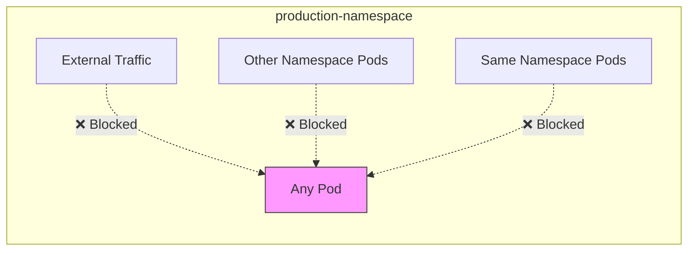
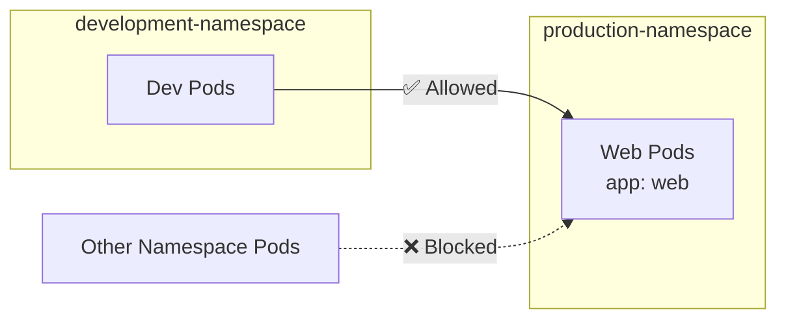
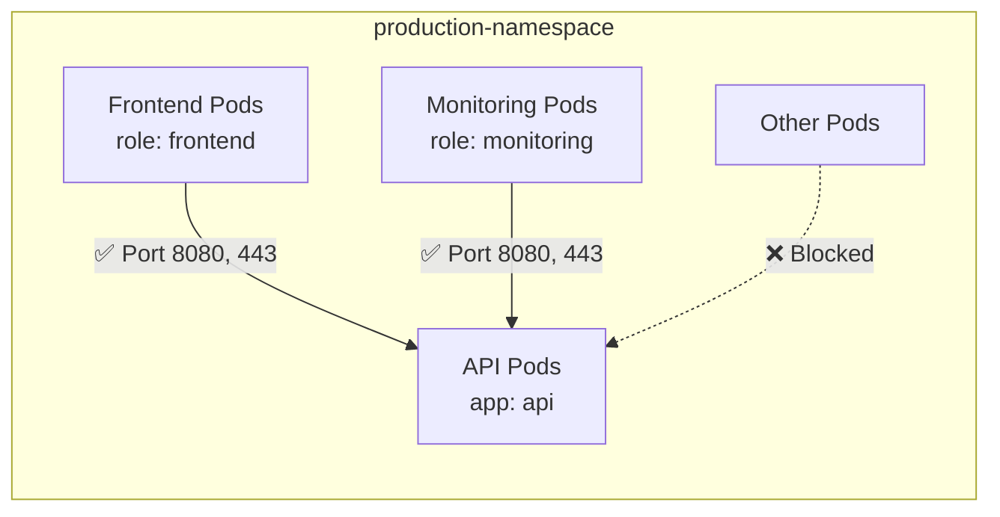
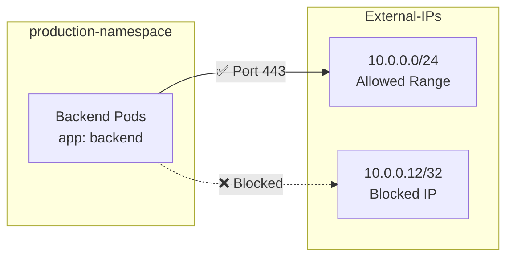
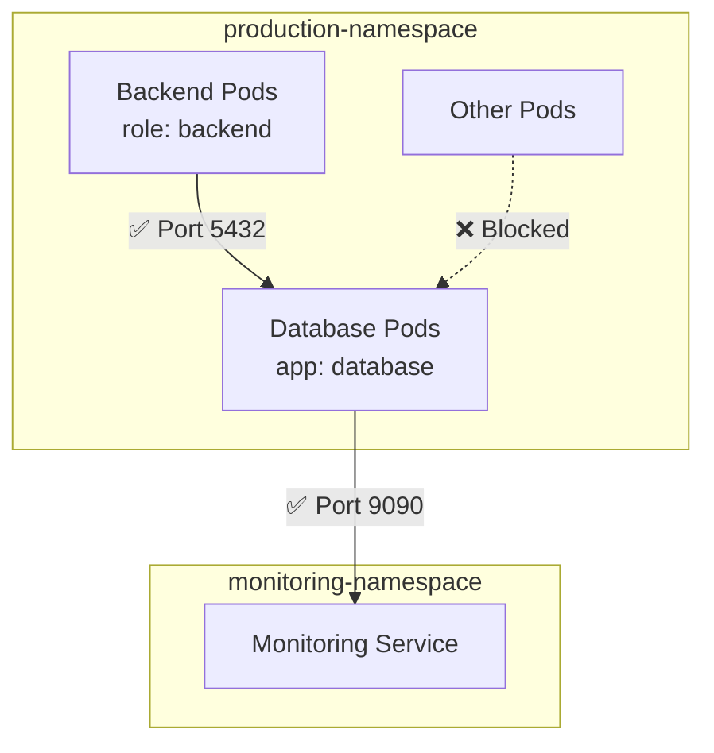
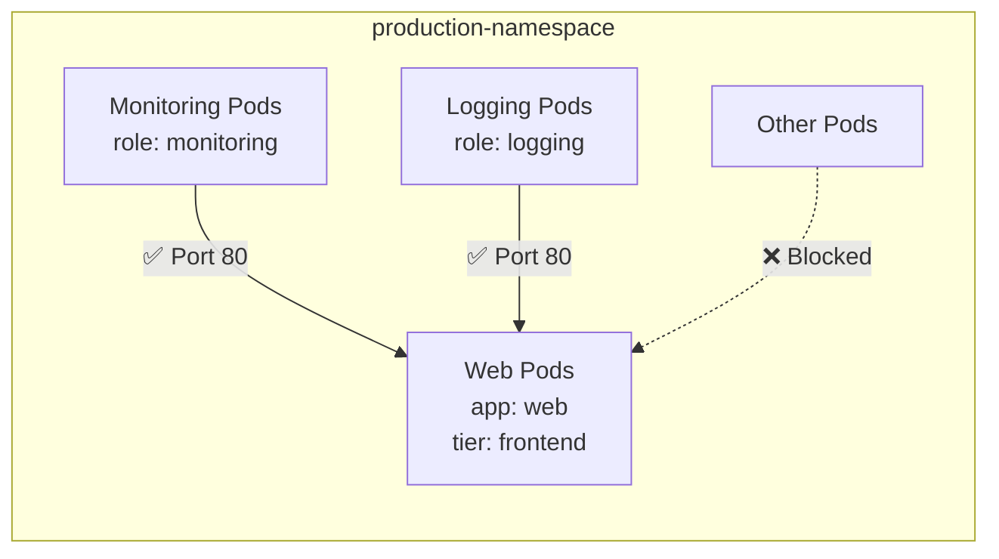
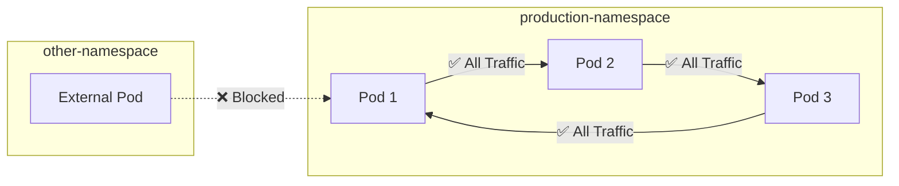
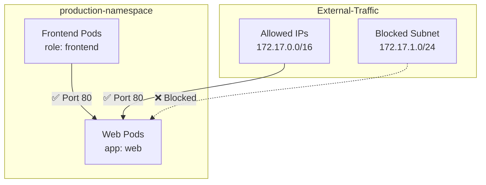
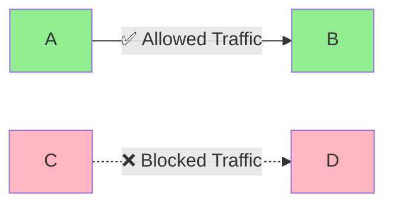

# Network Policy Flow Diagrams

## Example 1: Deny All Ingress Traffic
### Flow Diagram


### Policy Code
```yaml
apiVersion: networking.k8s.io/v1
kind: NetworkPolicy
metadata:
  name: default-deny-ingress
  namespace: production
spec:
  podSelector: {}  # Empty selector means select all pods
  policyTypes:
  - Ingress      # Only applying to incoming traffic
```

## Example 2: Allow Traffic from Specific Namespace
### Flow Diagram


### Policy Code
```yaml
apiVersion: networking.k8s.io/v1
kind: NetworkPolicy
metadata:
  name: allow-from-dev-namespace
  namespace: production
spec:
  podSelector:           # This policy applies to pods with label app: web
    matchLabels:
      app: web
  policyTypes:
  - Ingress
  ingress:
  - from:
    - namespaceSelector:    # Select source namespace based on labels
        matchLabels:
          environment: development
```

## Example 3: Multi-Port Multi-Source
### Flow Diagram


### Policy Code
```yaml
apiVersion: networking.k8s.io/v1
kind: NetworkPolicy
metadata:
  name: multi-port-multi-source
  namespace: production
spec:
  podSelector:
    matchLabels:
      app: api          # Applies to API pods
  policyTypes:
  - Ingress
  ingress:
  - from:              # Multiple source pods can access
    - podSelector:
        matchLabels:
          role: frontend    # Allow frontend pods
    - podSelector:
        matchLabels:
          role: monitoring  # Allow monitoring pods
    ports:             # Define allowed ports
    - protocol: TCP
      port: 8080      # Main API port
    - protocol: TCP
      port: 443       # HTTPS port
```

## Example 4: External Egress Control
### Flow Diagram


### Policy Code
```yaml
apiVersion: networking.k8s.io/v1
kind: NetworkPolicy
metadata:
  name: allow-external-egress
  namespace: production
spec:
  podSelector:
    matchLabels:
      app: backend     # Applies to backend pods
  policyTypes:
  - Egress            # Controls outgoing traffic
  egress:
  - to:
    - ipBlock:
        cidr: 10.0.0.0/24           # Allow traffic to this IP range
        except:
        - 10.0.0.12/32              # Except this specific IP
    ports:
    - protocol: TCP
      port: 443                     # HTTPS traffic only
```

## Example 5: Complex Policy with Ingress and Egress
### Flow Diagram


### Policy Code
```yaml
apiVersion: networking.k8s.io/v1
kind: NetworkPolicy
metadata:
  name: complex-policy
  namespace: production
spec:
  podSelector:
    matchLabels:
      app: database    # Applies to database pods
  policyTypes:
  - Ingress
  - Egress
  ingress:
  - from:
    - namespaceSelector:    # Must be in production namespace
        matchLabels:
          environment: production
      podSelector:          # AND must be a backend pod
        matchLabels:
          role: backend
    ports:
    - protocol: TCP
      port: 5432           # PostgreSQL port
  egress:
  - to:
    - namespaceSelector:    # Allow sending metrics to monitoring
        matchLabels:
          environment: monitoring
    ports:
    - protocol: TCP
      port: 9090           # Prometheus port
```

## Example 6: Multi-Label Selector
### Flow Diagram


### Policy Code
```yaml
apiVersion: networking.k8s.io/v1
kind: NetworkPolicy
metadata:
  name: multi-label-selector
  namespace: production
spec:
  podSelector:
    matchLabels:
      app: web
      tier: frontend    # Pods must have both labels
  policyTypes:
  - Ingress
  ingress:
  - from:
    - podSelector:
        matchExpressions:   # More flexible than matchLabels
        - key: role
          operator: In     # Allows multiple values
          values: ["monitoring", "logging"]
    ports:
    - protocol: TCP
      port: 80
```

## Example 7: Allow Same Namespace
### Flow Diagram


### Policy Code
```yaml
apiVersion: networking.k8s.io/v1
kind: NetworkPolicy
metadata:
  name: allow-same-namespace
  namespace: production
spec:
  podSelector: {}      # Applies to all pods in namespace
  policyTypes:
  - Ingress
  ingress:
  - from:
    - podSelector: {}  # Allow from all pods in same namespace
```

## Example 8: External and Internal Traffic
### Flow Diagram


### Policy Code
```yaml
apiVersion: networking.k8s.io/v1
kind: NetworkPolicy
metadata:
  name: allow-external-and-internal
  namespace: production
spec:
  podSelector:
    matchLabels:
      app: web        # Applies to web pods
  policyTypes:
  - Ingress
  ingress:
  - from:
    - ipBlock:        # Allow external IPs
        cidr: 172.17.0.0/16
        except:
        - 172.17.1.0/24    # Blocked subnet
    - podSelector:         # Allow internal pods
        matchLabels:
          role: frontend
    ports:
    - protocol: TCP
      port: 80            # HTTP traffic
```

## Legend


## Notes
- Green boxes represent allowed sources/destinations
- Red dotted lines represent blocked traffic
- Solid lines represent allowed traffic
- Labels on arrows show allowed ports
- Each diagram represents the traffic flow after the network policy is applied
- Pods are labeled with their selector labels for clarity
- YAML code shows the exact implementation for each scenario
